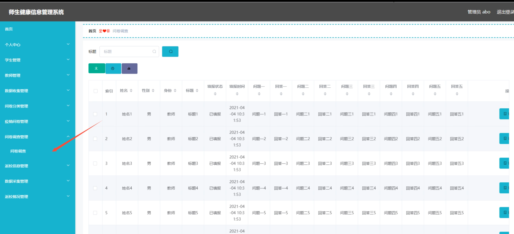

# 基于springboot的师生健康信息管理系统

---
### 👉作者QQ ：1556708905 微信：zheng0123Long (支持定制修改、部署调试、定制毕设)

### 👉接网站建设、小程序、H5、APP、各种系统等

---

#### 介绍

随着疫情防控的常态化，学校对师生健康信息的管理需求不断增加，传统的管理方式已经无法满足快速变化的防控要求。基于SpringBoot的师生健康信息管理系统应运而生，旨在提升学校对师生健康数据的管理效率，保障师生的健康和安全。系统通过精细化的数据采集和管理，实现了对健康信息的全面掌控。

#### 技术栈

后端技术栈：Springboot+Mysql+Maven

前端技术栈：Vue+Html+Css+Javascript+ElementUI

开发工具：Idea+Vscode+Navicate

#### 系统功能介绍

管理端功能模块

个人中心：管理员可以查看和编辑个人信息，管理账户安全。  
学生管理：管理学生的健康信息，更新和维护学生数据。  
教师管理：管理教师的健康信息，更新和维护教师数据。  
数据收集管理：收集和管理全校师生的健康数据。  
问卷分类管理：管理问卷的分类，确保问卷分类清晰明了。  
疫情问卷管理：发布和管理疫情相关问卷，收集师生的健康信息。  
问卷调查管理：进行各类问卷调查，收集相关数据。  
返校信息管理：管理师生的返校信息，确保返校流程安全有序。  
数据采集管理：采集和处理师生健康数据，生成报告。  
返校情况管理：跟踪和管理师生的返校情况，确保防控措施到位。  

学生端功能模块  

个人中心：学生可以查看和编辑个人信息，管理账户安全。  
数据收集管理：提交个人健康数据，配合学校的防控要求。  
疫情问卷管理：填写疫情相关问卷，报告健康状况。  
返校信息管理：提交返校信息，确保返校流程顺利。  

教师端功能模块

个人中心：教师可以查看和编辑个人信息，管理账户安全。  
疫情问卷管理：填写疫情相关问卷，报告健康状况。  
数据采集管理：采集学生健康数据，生成班级健康报告。  
返校情况管理：跟踪学生的返校情况，确保班级防控措施到位。  

#### 系统作用

对管理端的作用

高效管理：通过集成的数据收集和管理功能，提高学校对健康信息的管理效率。  
防控保障：及时收集和分析健康数据，保障师生的健康和安全。  
信息传达：通过问卷和调查，确保防控信息及时传达和落实。  

对教师端的作用

数据采集：简化学生健康数据的采集流程，提高班级防控管理的效率。  
健康监控：实时跟踪学生的健康状况，及时采取防控措施。  

对学生端的作用

便捷提交：通过系统方便地提交健康数据和返校信息，配合学校的防控要求。  
信息透明：了解自身健康数据的管理情况，增强健康意识。  

#### 系统功能截图

代码结构

数据库表

登录

学生管理

教师管理

数据收集

疫情问卷

问卷调查

数据采集

学生端页面信息

返校信息

教师端页面信息

#### 总结

基于SpringBoot的师生健康信息管理系统，通过科学合理的角色分工和功能模块设计，实现了学校对师生健康信息的高效管理。系统不仅提升了数据管理的效率，还保障了师生的健康和安全，为学校的疫情防控提供了有力支持。

#### 使用说明

创建数据库，执行数据库脚本 修改jdbc数据库连接参数 下载安装maven依赖jar 启动idea中的springboot项目

后台地址:http://localhost:8080/springboot43q56/admin/dist/index.html

管理员  abo 密码 abo

